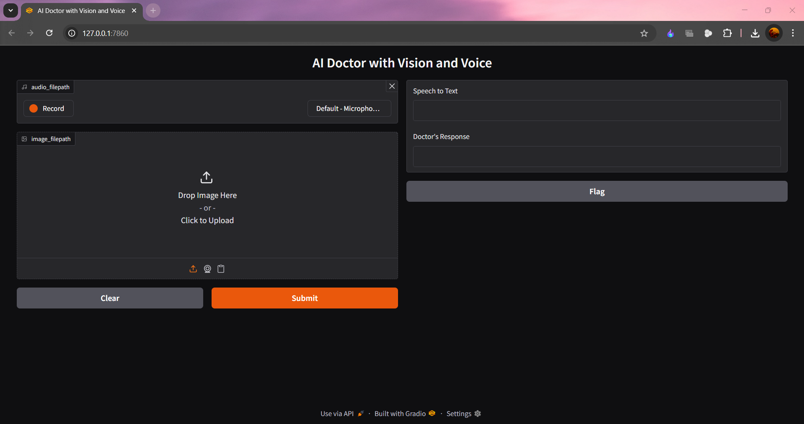
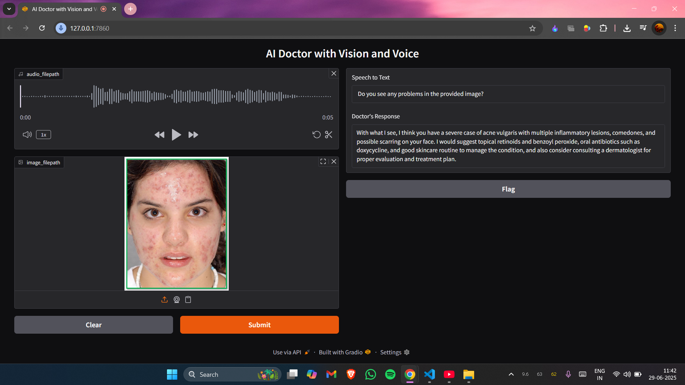

# 🩺 DocAssist – AI-Powered Medical Assistant

**DocAssist** is an intelligent voice and vision-based medical assistant that interacts like a real doctor. It listens to patient symptoms, analyzes medical images, and responds with personalized suggestions—all powered by cutting-edge AI technologies.

---

## 🚀 Features

- 🎤 Voice input from patients (microphone-based)
- 🧠 Symptom analysis using Groq’s LLMs
- 🖼️ Medical image diagnosis (e.g., skin problems,tumor etc.)
- 🔊 Natural-sounding doctor response via text-to-speech (gTTS/ElevenLabs)
- 🖥️ Gradio-based user interface
- 🛡️ Environment managed using `pipenv`

---

## Workflow of the Project:
  1. User records voice input describing symptoms.

  2. Addionally, an image of a medical issue is uploaded.

  3. The app transcribes the audio using Whisper via Groq.

  4. The image and text are sent to a Groq-hosted LLM for analysis.

  5. The LLM responds with a concise diagnosis and suggestion.

  6. The response is spoken back to the user using gTTS or ElevenLabs.


---


## ⚙️ Setup Instructions

### 1. 📥 Clone the Repository

```bash
git clone https://github.com/your-username/DocAssist.git
cd DocAssist
```

### 2. pip install pipenv
```bash
pip install pipenv
```

### 3. Install other dependencies
```bash
pipenv install requirements.txt
```

### 4. Set Up Environment Variables
Create a `.env` file in the root directory and add the your API keys:
```bash
GROQ_API_KEY=your_groq_api_key_here
ELEVENLABS_API_KEY=your_elevenlabs_api_key_here
```

### 5. Activate Virtual Environment
```bash
pipenv shell
```
### 6. Launch the App
```bash
python gradio_app.py
```
or Simply click on Run button on top-right side.

### 7. Then open the app in your browser at:
```
http://127.0.0.1:7860
```
or any other port(check it in your terminal after running the project)

<br>
<br>

---

### Live Server:
<p align="center">
  
</p>
<br>
<br>
<p align="center">
  
</p>


